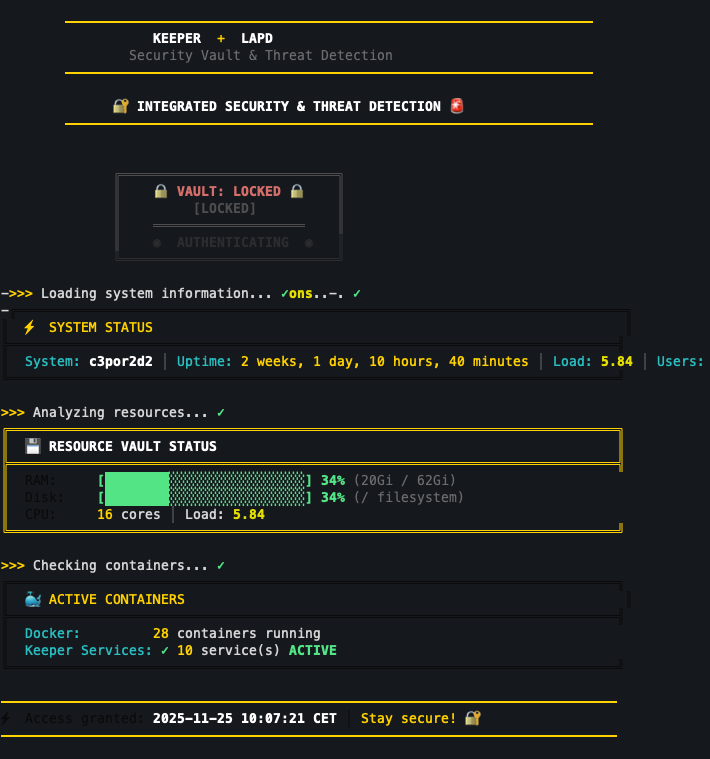
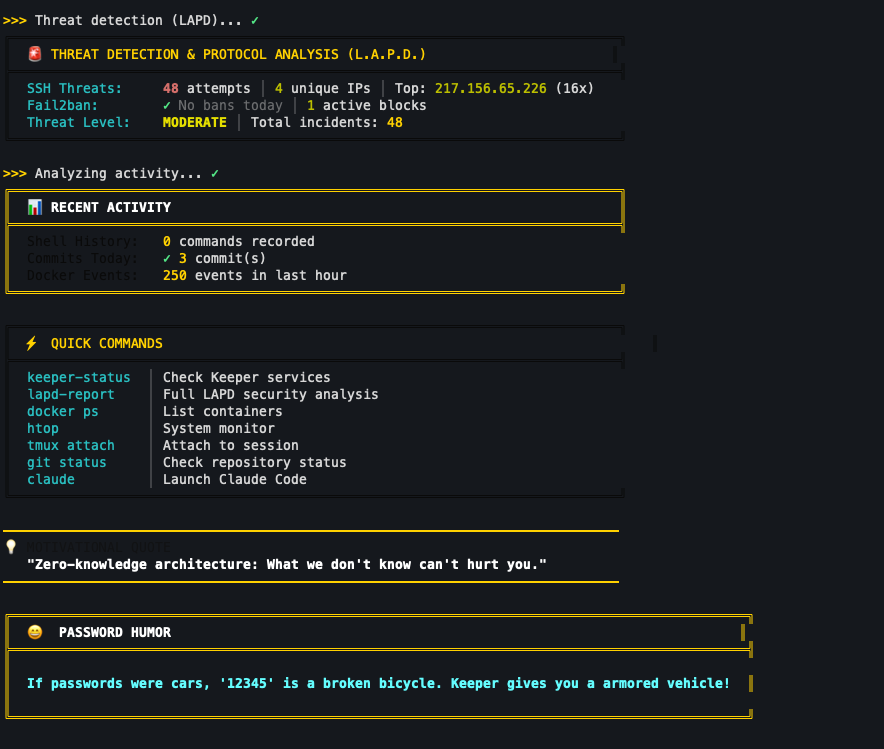

# Server Security Toolkit

<table>
<tr>
<td></td>
<td></td>
</tr>
</table>

> **Hey there!** This is an unofficial, community-created project. The MOTD theme is inspired by Keeper Security but is **not affiliated with, endorsed by, or connected to Keeper Security, Inc.** Just a fan having fun with terminal aesthetics!

A collection of scripts that make your Linux server login experience way cooler while keeping things secure.

---

## What's This All About?

### SSH Doorknock Firewall
Think of it as a **VPN without the VPN** - SSH authentication grants your IP full access, no extra software needed.

```
┌─────────────────────────────────────────────────────────────────────┐
│                    SSH DOORKNOCK FIREWALL                           │
├─────────────────────────────────────────────────────────────────────┤
│                                                                     │
│   INTERNET                        YOUR SERVER                       │
│   ════════                        ═══════════                       │
│                                                                     │
│   Attacker ──────────────────X────► All Ports (BLOCKED)             │
│   (no SSH)                    │                                     │
│                               │    ┌─────────────────────┐          │
│                               └────│ DOCKER-USER: DROP   │          │
│                                    └─────────────────────┘          │
│                                                                     │
│   You ─────► SSH (port 22) ──────► PAM detects login                │
│   (with key)        │              │                                │
│                     │              ▼                                │
│                     │         ┌─────────────────────┐               │
│                     │         │ pam-whitelist-open  │               │
│                     │         │ - Add ACCEPT rule   │               │
│                     │         │ - Add DOCKER RETURN │               │
│                     │         └─────────────────────┘               │
│                     │              │                                │
│                     │              ▼                                │
│                     └────────► ALL PORTS (ALLOWED) ◄── You only!    │
│                                                                     │
│   On logout ──────────────────────► pam-whitelist-close             │
│                                     - Remove rules                  │
│                                     - Back to blocked               │
│                                                                     │
└─────────────────────────────────────────────────────────────────────┘
```

**The magic:**
1. Only SSH (port 22) can get through initially
2. Everything else? Blocked. Sorry, not sorry.
3. Login via SSH? Boom - **ALL ports** open for your IP
4. Logout? Access revoked. Like you were never there.
5. **No static whitelist IPs** - purely dynamic via SSH "doorknock"

### MOTD (Message of the Day)
Because staring at a boring login prompt is so last decade. Get greeted with style!

### Requirements

- Linux (any flavor - Debian, Ubuntu, RHEL, CentOS, Fedora, Arch, whatever)
- iptables
- Root access (sudo works too)
- Bash or Zsh
- Optional: fail2ban (makes threat detection cooler)
- Optional: Docker (if you want container stats)

---

## Quick Start

### SSH Doorknock Firewall Setup (PAM Method - Recommended)

The PAM method is the most reliable - it triggers on actual SSH session events, not shell startup.

**1. Copy scripts to /root:**
```bash
cp security/pam-whitelist-open.sh /root/
cp security/pam-whitelist-close.sh /root/
chmod +x /root/pam-whitelist-*.sh
```

**2. Configure PAM for SSH:**
```bash
# Add to /etc/pam.d/sshd:
echo "session optional pam_exec.so type=open_session /root/pam-whitelist-open.sh" >> /etc/pam.d/sshd
echo "session optional pam_exec.so type=close_session /root/pam-whitelist-close.sh" >> /etc/pam.d/sshd
```

**3. Set up Docker firewall (if using Docker):**
```bash
cp security/docker-user-firewall-init.sh /root/
cp security/docker-user-firewall.service /etc/systemd/system/
chmod +x /root/docker-user-firewall-init.sh
systemctl daemon-reload
systemctl enable docker-user-firewall.service
systemctl start docker-user-firewall.service
```

**4. Test it:**
```bash
# Open a NEW SSH session (keep current one open!)
# Check the whitelist log:
tail -f /var/log/ssh-whitelist.log
```

### Alternative: Shell-based Setup
```bash
chmod +x setup-ssh-whitelist.sh
./setup-ssh-whitelist.sh
```

### MOTD Setup
```bash
chmod +x .keeper_motd.sh
# Add to .bashrc or .zshrc:
# source ~/.keeper_motd.sh
```

---

## What You'll See on Login

| Section | What It Shows |
|---------|---------------|
| **Vault Animation** | A fancy unlock sequence (because why not?) |
| **System Status** | Your server's vitals - hostname, uptime, load |
| **Resource Vault** | RAM, disk, CPU with cool progress bars |
| **Docker Status** | Container count and service health |
| **Projects** | Current project, git branch, uncommitted sins |
| **Security** | SSH connections, tmux sessions, who's lurking |
| **Threat Detection** | Failed login attempts, banned IPs, threat level |
| **Recent Activity** | What's been happening |
| **Quick Commands** | Handy shortcuts for the lazy (efficient!) |
| **Motivational Quote** | Wisdom to start your session |
| **Password Humor** | A joke to brighten your day |

### Threat Levels

| Level | What It Means |
|-------|---------------|
| **LOW** | Chill. 0-10 failed attempts |
| **MODERATE** | Someone's poking around. 11-50 attempts |
| **HIGH** | They're persistent. 50+ attempts |
| **CRITICAL** | Time to pay attention! 100+ attempts |

---

## Command Line Options

```bash
.keeper_motd.sh [OPTIONS]
```

| Option | What It Does |
|--------|--------------|
| `-h, --help` | Show help (you're reading this, so you're good) |
| `-d, --debug` | Nerd mode - see all the timing info |
| `-c, --clear-cache` | Fresh start, clear all cached data |
| `-l, --list-modules` | See what modules are available |
| `-m, --module NAME` | Run just one module |
| `-n, --no-animation` | Skip the fancy stuff, get to business |
| `-q, --quiet` | Shhhh mode |

### Examples

```bash
# Debug mode for the curious
.keeper_motd.sh --debug

# Just show the threat detection
.keeper_motd.sh -m 75-lapd

# In a hurry? Skip animations
.keeper_motd.sh --no-animation
```

---

## The Modules

They run in order (the numbers matter!):

| Module | Job |
|--------|-----|
| `10-header.sh` | The fancy title |
| `20-vault.sh` | That cool unlock animation |
| `30-system.sh` | System stats |
| `40-resources.sh` | RAM, disk, CPU bars |
| `50-containers.sh` | Docker stuff |
| `60-projects.sh` | Git and project info |
| `70-security.sh` | Who's connected |
| `75-lapd.sh` | Threat detection |
| `80-activity.sh` | Recent happenings |
| `85-commands.sh` | Quick command reference |
| `90-footer.sh` | Quotes and humor |

---

## Configuration

Create `~/.keeper_motd.conf` to tweak things:

```bash
# Turn stuff on/off
ENABLE_ANIMATIONS=true      # The vault animation
ENABLE_CACHE=true           # Speed things up
ENABLE_LAPD=true            # Threat detection
ENABLE_LAPD_THREATS=true    # Show threat details
ENABLE_QUOTES=true          # Motivational quotes
ENABLE_SECURITY_TIP=true    # Password humor

# Performance tweaks
MODULE_TIMEOUT=2            # Seconds before giving up on a module
DEBUG_MODE=false            # Extra output for troubleshooting

# When to panic about resources
RAM_WARNING=75              # Yellow at this %
RAM_CRITICAL=90             # Red at this %

# Log locations (adjust for your distro)
SSH_LOG=/var/log/secure     # RHEL/CentOS/Fedora
# SSH_LOG=/var/log/auth.log # Debian/Ubuntu
FAIL2BAN_LOG=/var/log/fail2ban.log
```

---

## Files in This Repo

### Security Scripts (`security/`)

| File | Purpose |
|------|---------|
| `pam-whitelist-open.sh` | PAM script - grants ALL port access on SSH login |
| `pam-whitelist-close.sh` | PAM script - revokes access when last session ends |
| `docker-user-firewall-init.sh` | Boot script to add DROP rule to DOCKER-USER chain |
| `docker-user-firewall.service` | Systemd service for Docker firewall persistence |
| `auto-whitelist-on-ssh.sh` | Alternative: shell-based whitelist (via .bashrc) |
| `auto-remove-whitelist.sh` | Alternative: shell-based removal (via .bash_logout) |
| `safe-firewall-hardening.sh` | Interactive firewall hardening with rollback |

### Root Level Files

| File | Purpose |
|------|---------|
| `setup-ssh-whitelist.sh` | One-click firewall setup |
| `.keeper_motd.sh` | Main MOTD script |
| `.keeper_motd.d/` | All the modules and framework |
| `password_humor.txt` | 251 jokes about passwords |
| `SSH-WHITELIST-FIREWALL.md` | Detailed firewall docs |

---

## License

MIT - Do whatever you want with it!
